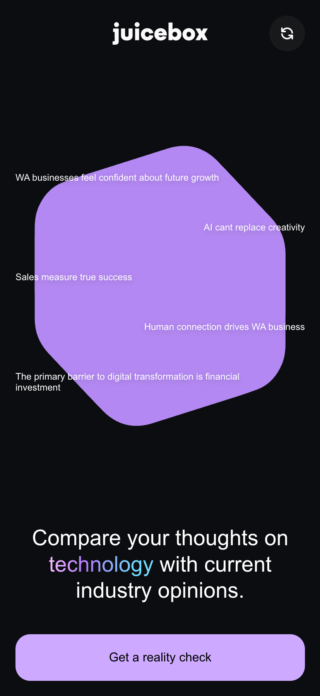
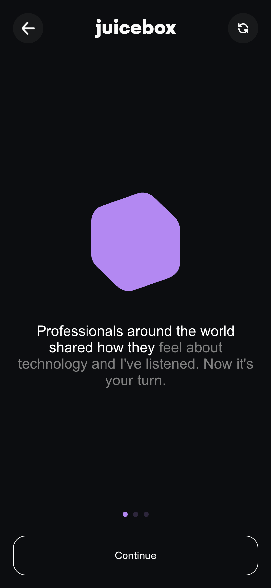
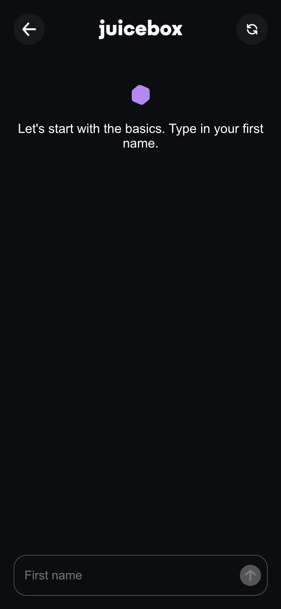
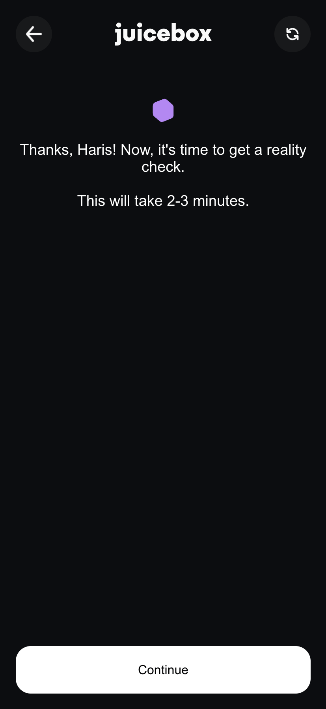

# Lottie Page

A simple web application built with Next.js and TypeScript. It provides home page, tutorial page, multi-step form for user input and displays results in a visually appealing way.

## Preview
| Home | Tutorial | Form | Result |
|------|--------|--------|----------|
|||||


## Getting Started

To get a local copy up and running, follow these simple steps.

### Installation

1. Clone the repo
   ```sh
   git clone https://github.com/haris0/lottie-page.git
   ```
2. Install NPM packages
   ```sh
   yarn install
   ```
3. Run the development server
   ```sh
   yarn dev
   ```

Open [http://localhost:3000](http://localhost:3000) with your browser to see the result.

## Libraries Used

* **Next.js**: A React framework for building server-side rendered and statically generated web applications.
* **React**: A JavaScript library for building user interfaces.
* **TypeScript**: A typed superset of JavaScript that compiles to plain JavaScript.
* **Swiper**: A modern touch slider which is focused on performance and amazing native behavior.
* **Lottie-React**: A library for adding Lottie animations to your React applications.
* **GSAP**: A professional-grade animation library for the modern web.
